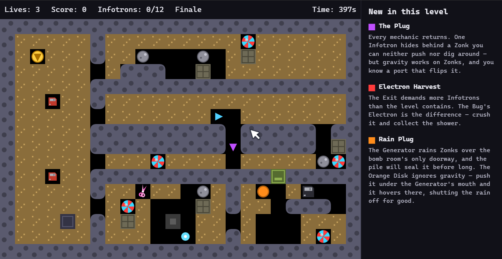
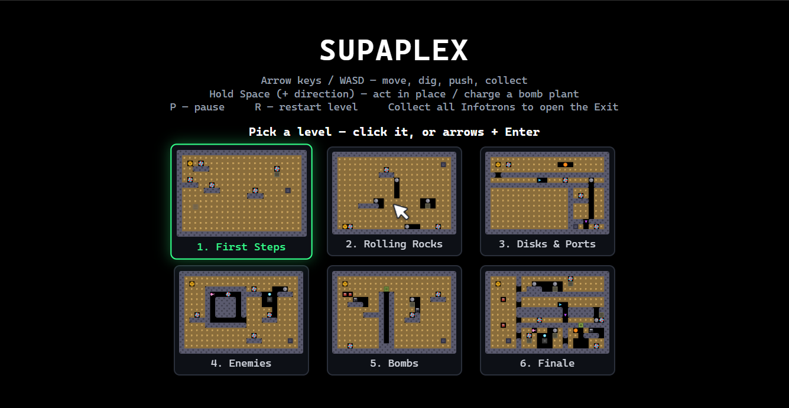

# Supaplex Clone

[](https://github.com/VictorZakharov/supaplex-sonnet5/actions/workflows/build.yml)
[](https://github.com/VictorZakharov/supaplex-sonnet5/actions/workflows/deploy.yml)
[](LICENSE)

A from-scratch clone of the classic puzzle game **Supaplex**, built with TypeScript,
Webpack, and Canvas2D — no game frameworks or external assets.

**[Play it live](https://victorzakharov.github.io/supaplex-sonnet5/)**



<details>
<summary>Level select menu</summary>



</details>

> **Disclaimer:** This is an independent, unofficial fan project. "Supaplex" and its
> original game design belong to their respective rights holders. Nothing here reuses
> any code or assets from the original game — every mechanic, sprite, and level is
> built from scratch in TypeScript and drawn with Canvas2D primitives.

## Features

Full mechanics fidelity, not a simplified subset:

- Tick-based physics (Zonks and Infotrons fall, roll off rounded surfaces, and can be
  pushed or squish Murphy)
- Diggable Base/dirt terrain
- Orange Disks, directional Ports, and Gravity Ports
- Zonk Generators
- Bug enemies with orbiting Electrons, and wall-following Snik-Snaks
- Two original-accurate bomb types: pushable/fallable impact bombs (explode on any
  collision) and timed bombs Murphy collects as pickups, then plants with a short
  Space-hold charge — next to himself or under his own feet
- A "Space + direction" action to collect an Infotron or dig a dirt tile on an adjacent
  cell without moving into it
- Round-vs-square object/terrain physics: only round-shaped objects (Zonks, Infotrons,
  Orange Disks) roll off round surfaces — square bombs and flat "Square Wall" terrain
  never roll
- 6 hand-authored levels: the first 5 each teach one mechanic, and the 6th ("Finale")
  combines everything into a hub with four independently-completable branch rooms

## Controls

- **Arrow keys** — move / dig / push
- **Space + direction** — act on the adjacent cell without moving (collect an Infotron
  or clear a dirt tile instantly; on open ground, hold to charge-plant a timed bomb)
- **Space (held, no direction)** — charge-plant a timed bomb under Murphy's own feet
- **P** — pause
- **R** — restart the current level

## Getting started

```bash
npm install
npm start          # dev server on http://localhost:8080, hot reload
```

Other commands:

```bash
npm run build       # production bundle to dist/
npx tsc --noEmit    # typecheck
```

There's no automated test suite — changes are verified via typecheck, a production
build, and manual/Playwright browser testing. See [CONTRIBUTING.md](CONTRIBUTING.md).

## Architecture

See [CLAUDE.md](CLAUDE.md) for a detailed breakdown of the tick-based physics engine,
grid/terrain/occupant model, level authoring, and a running list of hard-won
implementation gotchas.

## License

[MIT](LICENSE)
